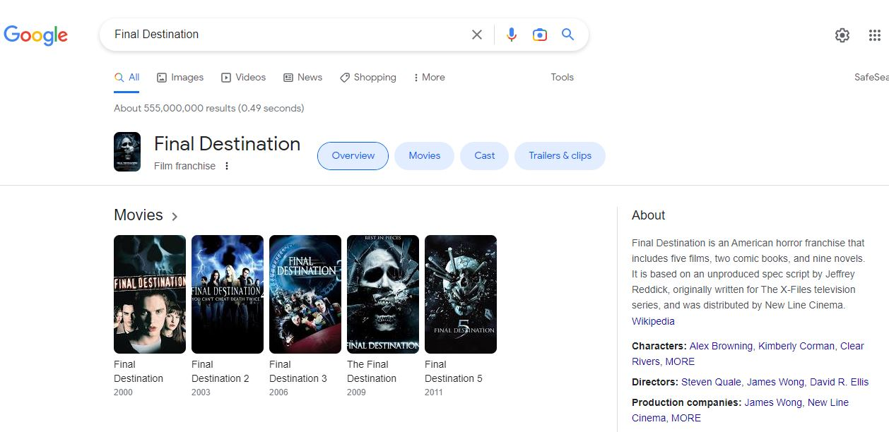

```{r echo=FALSE, out.width = '100%'}
knitr::include_graphics("netflixHomepage.JPG")
```

# About
This project is about analysing what makes a show on Netflix more likeable? 

Are TV shows more well received than Movies? 

Are action movies more popular than rom-coms? 

Are shows from Korean more popular than Thai shows?

This project aims to answer such questions via going through the whole process of creating a machine learning model


# Packages
Before we get started. We will load all the relevant Pacakages
```{r load packages, message=FALSE}
library(reticulate)
library(DBI)
library(dplyr)
library(lubridate)
library(tidyr)
library(data.table)
library(quanteda)
library(tm)
library(lsa)
library("quanteda.textmodels")
library(ggplot2)
library(kableExtra)
library(Hmisc)
library(ggcorrplot)
```

I also use a bit of Python for this project, so I will load some Python packages too

```{r echo=FALSE,}
use_python("C:/venv/Scripts/python.exe")
use_virtualenv("C:/venv")
```

```{python}
import pandas as pd
import requests
import urllib
from requests_html import HTML
from requests_html import HTMLSession
import bs4
```

# Getting Data 

I use two main data sources for this project, namely Kaggle and Google Search Results

### Source 1: Kaggle 
This dataset provides us with a list of Netflix Shows along with information such as the year it was added, duration, cast, description etc..
There are altogether 8807 Netflix Shows in this dataset.
```{r}
netflixData <- read.csv(file = 'datasets/dataset_main.csv')
```
```{r echo=FALSE}
# FOR Displaying results
# temp = head(netflixData, 10)
# temp %>%
#   kbl() %>%
#   kable_styling() %>%
#   column_spec(1, width = "10cm") %>%
#   scroll_box(width = "1000px", height = "500px")
```

### Source 2: Google Search Results 
The Kaggle dataset doesn’t contain any feature that gives us information about how popular or likable a show was. 
However, with the Netflix Show title, we can perform some web scraping to obtain Review Scores and other information off Google.

The image below shows an example of the data that will be collected for each of the 8808 shows in the Kaggle Dataset, namely Review Score, Description, Genre and Language
To represent popularity, I will use Google Review Scores, this is also going to be my dependent variable. 
```{r echo=FALSE, out.width = '100%'}
knitr::include_graphics("Search Example.JPG")
```

Google Scrapping Method
Below is the method I use to scrap data off Google. 
```{python}
def get_source(url):
    try:
        session = HTMLSession()
        response = session.get(url)
        return response
    except requests.exceptions.RequestException as e:
        print(e)

def get_googleInfo(title):
    scrapedData = []

    query = urllib.parse.quote_plus(title)
    response = get_source("https://www.google.co.uk/search?q=" + query)
    soup = bs4.BeautifulSoup(response.text,"html.parser")

    rating_object=soup.find_all( "div", {"class":"a19vA"} )
    info_object=soup.find_all( "div", {"class":"rVusze"} )
    desc_object=soup.find_all( "div", {"class":"PZPZlf hb8SAc"} )

    scrapedData.append('Title: ' +title)

    for rating in rating_object:
        ratingInfo = rating.getText()
        rating = ratingInfo[0:3]
        scrapedData.append('Rating: ' +rating)

    for info in info_object:
        info = info.getText()
        if 'Language' in info:
            scrapedData.append(info)
            break
    
    for info in info_object:
        info = info.getText()
        if 'Genre' in info:
            scrapedData.append(info)
            break

    for desc in desc_object:
        description = desc.getText()
        description = description[0:11] + str(': ') + description[11:]
        scrapedData.append(description)
        break
    
    return scrapedData
```
Here is an example of Output, when we insert the hit show "Squid Game" into the method above.

``` {python}
info = get_googleInfo("Squid Game")
print(info)
```


Apply data scraping function on all movie/show titles in dataset. 
Once all the information has been scraped, I write it into a csv file (full code in GitHub).
``` {python eval = FALSE}
# data = pd.read_csv('netflix_titles.csv')
# goolgeInfo = data['title'].apply(get_googleInfo)
# goolgeInfo.to_csv('googleInfo.csv', encoding='utf-8', index=False)
print("hi")
```

Since the data scrapping was done in Python, I now need to load all Google Search Results data into the R world of this project.
``` {r}
googleData <- read.csv(file = 'datasets/dataset_googleScraped.csv')
```

### Joining the Kaggle Dataset and Google Search Results
I combine both datasets. 
```{r}
con <- dbConnect(RSQLite::SQLite(), ":memory:")

dbWriteTable(con, "netflixData", netflixData)
dbWriteTable(con, "googleData", googleData)

query <- "SELECT netflixData.show_id
        , netflixData.type
        , netflixData.title
        , netflixData.director
        , netflixData.cast
        , netflixData.country
        , netflixData.date_added
        , netflixData.release_year
        , netflixData.rating
        , netflixData.duration
        , netflixData.listed_in
        , netflixData.description
        , googleData.Likes
        , googleData.Languages
        , googleData.Genres
        , googleData.Descriptions
        FROM netflixData left join googleData 
        ON netflixData.show_id= googleData.show_id"
res <- dbSendQuery(con, query)
df <- dbFetch(res)

dbClearResult(res)
```

Both datasets are now joined but the feature names are quite confusing still. I will rename the features before showing a preview of the full combined dataset I will be working with.

# Previewing Raw Data
## Renaming Columns
I rename the columns because some of them had the same names. 
Independent features that were scraped from Google have "google_" at the front of them.
``` {r}
new_names <- c("id" 
        , "type"
        , "title"
        , "director"
        , "cast"
        , "country"
        , "date_added"
        , "release_year"
        , "rating"
        , "duration"
        , "genre"
        , "plot"
        , "google_score"
        , "google_language"
        , "google_genre"
        , "google_plot")
df <- setNames(df, new_names)
```
## Data Preview
Here is what the dataset looks like now, we can see all the features that will be used:
``` {r echo=FALSE}
temp = head(df, 10)
temp %>%
  kbl() %>%
  kable_styling() %>%
  column_spec(1, width = "10cm") %>%
  scroll_box(width = "1000px", height = "500px")
```


# Cleaning the data

## Removing duplicates or irrelevant observations
## Dealing with duplicates 
Checking if there are any duplicated Netflix Shows
``` {r}
print(length(unique(df$title)))
```

``` {r}
print(df[duplicated(df$title),])
```
The Netflix shows that were thought to be duplicates by the code before seemed like dates instead.
No duplicates. So we can move on. 

### Drop rows
Any Netflix Show which does not have a Google Review Score (crucial dependent variable) is an irrelevant observation since it cannot be used for Analysis.
``` {r}
count_blanks <- function(feature) {
    string1 <- feature
    string2 <- '== ""'
    subset = paste(string1, string2)
    subset <- subset(df, eval(parse(text=subset)))
    count <- count(subset)
  return(count)
}

print(count_blanks('google_score'))
```

As expected, the Google search results of some Netflix Shows did not give us a Google Review Score. I drop these rows.
```{r}
df <- df[grep("%", df$google_score),]
```
Below shows and example of a Show which does not give us a Google Review Score
```{r echo=FALSE, out.width = '100%'}

```

We are now left with 6511 rows.
``` {r}
print(length(unique(df$title)))
```

## Handle Missing data
``` {r}
#desc <- describe(df)
#print(desc)
```

```{r}
feature <- new_names # retrieving all the column names

NA_Count <- c(
 toString(count_blanks('id'))
, toString(count_blanks('type'))
, toString(count_blanks('title'))
, toString(count_blanks('director'))
, toString(count_blanks('cast'))
, toString(count_blanks('country'))
, toString(count_blanks('date_added'))
, toString(count_blanks('release_year'))
, toString(count_blanks('rating'))
, toString(count_blanks('duration'))
, toString(count_blanks('genre'))
, toString(count_blanks('plot'))
, toString(count_blanks('google_score'))
, toString(count_blanks('google_language'))
, toString(count_blanks('google_genre'))
, toString(count_blanks('google_plot')))
NA_Count <- data.frame(feature, NA_Count)

print(NA_Count)

```

Google Genre and Google Language are missing in a big proportion of rows.
Action: Instead of removing the feature entirely, I'd like to extract some value out of it. I will transform google_language and google_genre feature into present/absent.

``` {r}
df$google_language <- ifelse(df$google_language =="", "absent", "present")
view <- df %>% group_by(google_language) %>% summarise(count = n())
print(view)
```
``` {r}
df$google_genre <- ifelse(df$google_genre =="", "absent", "present")
view <- df %>% group_by(google_genre) %>% summarise(count = n())
print(view)
```


## Fixing structural errors.
Structural errors are when you measure or transfer data and notice strange naming conventions, typos, or incorrect capitalization. These inconsistencies can cause mislabeled categories or classes. For example, you may find “N/A” and “Not Applicable” both appear, but they should be analyzed as the same category. Changing data types

We will look feature by feature for structural errors.

### 1. Type
``` {r}
view <- df %>% group_by(type) %>% summarise(count = n())
print(view)
```
The type feature looks clean, no action will be taken on it.
Action: None

### 2. director
``` {r}
view <- df %>% group_by(director) %>% summarise(count = n())
print(view)
```
Some of the rows have more than one director. 
Action: In the next Feature Engineering Section, I will make mapping tables and use feature engineering to capture this variable

### 3. Cast
``` {r}
view <- df %>% group_by(cast) %>% summarise(count = n())
print(view)
```
As expected, many Shows have more than one cast member. 
Action: Similar to what will be done with the Director Feature, I will make mapping tables and use feature engineering to capture this variable

### 4. Country
``` {r}
view <- df %>% group_by(country) %>% summarise(count = n())
print(view)
```
Some shows originated from several different countries.
Action: Similar to what will be done with the Director and Cast Feature, I will make mapping tables and use feature engineering to capture this variable.


### 5. Date Added
``` {r}
view <- df %>% group_by(date_added) %>% summarise(count = n())
print(view)
print(typeof(df$date_added))
```
Date Added is in the character format.
Action: Change this to date format
``` {r}
df$date_added <- mdy(df$date_added)
```

### 6. Release Year
``` {r}
view <- df %>% group_by(release_year) %>% summarise(count = n()) # Show release_year and count by each release_year
print(view)
print(typeof(df$release_year))
```
Release Year has the integer type. No noticable structural error.
Action: None

### 7. Rating
``` {r}
view <- df %>% group_by(rating) %>% summarise(count = n()) # Show release_year and count by each release_year
print(view)
```
There are several categories which have the same meaning.
Action: Consolidate the categories

Consolidate the categories of the Rating Feature
```{r}
df$rating[df$rating == "PG-13" ] <- "PG"
df$rating[df$rating == "TV-PG" ] <- "PG"
df$rating[df$rating == "TV-14" ] <- "PG"
df$rating[df$rating == "TV-G" ] <- "G"
df$rating[df$rating == "TV-MA" ] <- "R"
df$rating[df$rating == "NC-17" ] <- "R"
df$rating[df$rating == "TV-Y7" ] <- "Y"
df$rating[df$rating == "TV-Y7-FV" ] <- "Y"
df$rating[df$rating == "TV-Y" ] <- "Y"
df$rating[df$rating == "NR" ] <- "UR"
df$rating[df$rating == "66 min" ] <- "UR"
df$rating[df$rating == "84 min" ] <- "UR"
df$rating[df$rating == ""] <- "UR"

view <- df %>% group_by(rating) %>% summarise(count = n()) # Show release_year and count by each release_year
print(view)
```


### 8. Duration
``` {r}
view <- df %>% group_by(duration) %>% summarise(count = n()) # Show duration and count by each release_year
print(view)
```
Durations with two different units are in the same feature. Also, we can remove their units to make it integers.
Action: Split column into two different types of durations, remove units
``` {r}
df$duration[df$duration ==""] <- NA
df$duration_min <- ifelse(grepl("min", df$duration),df$duration,NA)
df$duration_season <- ifelse(grepl("Season", df$duration),df$duration,NA)
print(head(df[,c("title","duration_min","duration_season")]))
```

Remove string from duration and convert character to integer
``` {r}
df$duration_min <-  gsub('min','',df$duration_min)
df$duration_min <- as.numeric(df$duration_min)
df$duration_season <-  gsub('Seasons','',df$duration_season)
df$duration_season <-  gsub('Season','',df$duration_season)
df$duration_season <- as.numeric(df$duration_season)
print(head(df[,c("title","duration_min","duration_season")]))
```

Drop duration column
```{r}
df = subset(df, select = -c(duration))
```

### 9. Genre
``` {r}
view <- df %>% group_by(genre) %>% summarise(count = n()) # Show genre and count by each genre
print(view)
```
Some of the rows have more than one genre. 
Action: In the next Feature Engineering Section, I will make mapping tables and use feature engineering to capture this variable

### 10. Plot
Plot contains text data.
Action: Use Latent Semantic Analysis to categorize plots


### 11. Google Score
``` {r}
view <- df %>% group_by(google_score) %>% summarise(count = n()) # Show google_score and count by each google_score
print(view)
```
Symbol exist and type is character
Action: remove symbol and convert type to numeric

``` {r}
df$google_score<-gsub("%","",as.character(df$google_score))
df <- transform(df, google_score = as.numeric(google_score))
```

### 13. Google language
Feature was engineered already, so it is clean.

### 14. Google genre
Feature was engineered already, so it is clean.

### 15. Goolge Plot
Goolge Plot contains text data.
Action: Use Latent Semantic Analysis to categorize plots


# Filter unwanted outliers (pending section)

# Data Transformation

## Mapping Tables 
As talked about in the Data Cleaning Section above, I will build a mapping table for Cast, Director, Country and Genre. 
This would help reflect their one to many relationship.

### Build Director Mapping Table
``` {r}

director_mapping <- df %>%
    mutate(director = strsplit(as.character(director), ",")) %>%
    unnest(director)

director_mapping = subset(director_mapping, select = c(id, director))
director_mapping$director <- trimws(director_mapping$director , which = c("left"))

write.csv(director_mapping, "datasets/mapping_director.csv", row.names=FALSE)
```

### Build Cast Mapping Table
``` {r}
cast_mapping <- df %>%
    mutate(cast = strsplit(as.character(cast), ",")) %>%
    unnest(cast)

cast_mapping = subset(cast_mapping, select = c(id, cast))
cast_mapping$cast <- trimws(cast_mapping$cast, which = c("left"))
write.csv(cast_mapping, "datasets/mapping_cast.csv", row.names=FALSE)
```

### Build Country Mapping Table
``` {r}

country_mapping <- df %>%
    mutate(country = strsplit(as.character(country), ",")) %>%
    unnest(country)

country_mapping = subset(country_mapping, select = c(id, country))
country_mapping$country <- trimws(country_mapping$country, which = c("left"))

write.csv(country_mapping, "datasets/mapping_country.csv", row.names=FALSE)
```

### Build Genre Mapping Table
``` {r}
genre_mapping <- df %>%
    mutate(genre = strsplit(as.character(genre), ",")) %>%
    unnest(genre)

genre_mapping = subset(genre_mapping, select = c(id, genre))
genre_mapping$cast <- trimws(genre_mapping$genre, which = c("left"))
write.csv(genre_mapping, "datasets/mapping_genre.csv", row.names=FALSE)
```

# Feature engineering  
### Cast
IMDB provides a dataset of Top 1000 Actors and Actresses based on their popularity. 

Analyse the IMDB actors dataset
``` {r}
IMDBActors <- read.csv(file = 'datasets/dataset_popular_actors.csv')
print(head(IMDBActors))
```
The dataset  includes a numeric measure of their popularity in the column "Points".
I clean that column so that it can be engineered, transformed and used as a feature in the main dataset.
I write the data into a csv as a view

```{r}
IMDBActors <- separate(IMDBActors, Description, c("Points", "Description"))
IMDBActors <- transform(IMDBActors, Points = as.numeric(Points))
```

I do the same with the IMDB Actress dataset
``` {r}
IMDBActress <- read.csv(file = 'datasets/dataset_popular_actresses.csv')

IMDBActress <- separate(IMDBActress, Description, c("Points", "Description"))
IMDBActress <- transform(IMDBActress, Points = as.numeric(Points))

```

Once that is done, I attach the points of each Actor/Actress to the cast mapping table. (Not all cast members in the table have points because they may not be in the IMDB list)
``` {r message=FALSE}
con <- dbConnect(RSQLite::SQLite(), ":memory:")

dbWriteTable(con, "cast", cast_mapping)
dbWriteTable(con, "actorsPoints", IMDBActors)
dbWriteTable(con, "actressesPoints", IMDBActress)

query <- "SELECT c.id
                ,c.cast
                ,CASE WHEN a.Points IS NOT NULL THEN a.Points
                WHEN b.Points IS NOT NULL THEN b.Points 
                ELSE 0 END AS Points
                FROM cast c
                LEFT JOIN actorsPoints a ON c.cast = a.Name
                LEFT JOIN actressesPoints b ON c.cast = b.Name"
res <- dbSendQuery(con, query)

castPointsMapping <- dbFetch(res)

dbWriteTable(con, "castPointsMapping", castPointsMapping)
```

For each Show/Movie, take the points of the most famous Actor/Actress and attach it to the main table
```{r}
dbWriteTable(con, "main", df)

query <- "SELECT a.*
        , CASE WHEN c.Points IS NOT NULL THEN max(c.Points)
        ELSE 0 END AS cast_points
        FROM main a 
        LEFT JOIN castPointsMapping c ON a.id = c.id 
        GROUP BY a.id"

res <- dbSendQuery(con, query)
df <- dbFetch(res)

print(head(df[,c("title","cast_points")]))

```
### Directors
I do the same for directors
``` {r message=FALSE} 
IMDBDirectors <- read.csv(file = 'datasets/dataset_popular_directors.csv')

IMDBDirectors <- separate(IMDBDirectors, Description, c("Points", "Description"))
IMDBDirectors <- transform(IMDBDirectors, Points = as.numeric(Points))

dbWriteTable(con, "main_2", df)
dbWriteTable(con, "directorsPoints", IMDBDirectors)
dbWriteTable(con, "director", director_mapping)

query <- "SELECT a.id
                ,a.director
                ,CASE WHEN d.Points IS NOT NULL THEN d.Points
                ELSE 0 END AS Points
                FROM director a
                LEFT JOIN directorsPoints d ON a.director = d.Name"
res <- dbSendQuery(con, query)
directorPointsMapping <- dbFetch(res)
dbClearResult(res)

dbWriteTable(con, "directorPointsMapping", directorPointsMapping)

query <- "SELECT a.*
        , CASE WHEN d.Points IS NOT NULL THEN max(d.Points)
        ELSE 0 END AS director_points
        FROM main_2 a 
        LEFT JOIN directorPointsMapping d ON a.id = d.id 
        GROUP BY a.id"

res <- dbSendQuery(con, query)
df <- dbFetch(res)

dbClearResult(res)

print(head(df[,c("title","director_points")]))
``` 

Before carrying out further analysis, I disconnect from SQLite I write the main dataframe into a csv 
``` {r}
dbDisconnect(con)
write.csv(df, "datasets/view_main_cleaned.csv", row.names=FALSE)
```


# Feature Engineering -  Latent Semantic Analysis of Plot and google plot data
# load data

#``` {r}
main <- read.csv(file = 'datasets/view_main_features.csv')
main$plot_combined <- paste(main$plot,main$google_plot)
#```
# Convert data to corpus
#``` {r}
corpus <- Corpus(VectorSource(main$plot_combined))
#```

# Remove special characters, case, punctuation and numbers
#``` {r}

removeSpecialChars <- function(x) gsub("[^a-zA-Z0-9 ]","",x)
corpus <- tm_map(corpus, removeSpecialChars)
corpus <- tm_map(corpus, removeNumbers)
corpus <- tm_map(corpus, removePunctuation)
corpus <- tm_map(corpus, content_transformer(tolower))
#```

# Remove stop words
#``` {r}
corpus <- tm_map(corpus, removeWords, stopwords("english"))
#```

# Remove white space
#``` {r}
corpus <- tm_map(corpus, stripWhitespace)
#```

# Stemming
#``` {r}
corpus <- tm_map(corpus, stemDocument)
#```

# Term document matrix
#``` {r}
tdm <- TermDocumentMatrix(corpus)
#```

# View top 5 most frequently occuring term
#``` {r}
tdmMatrix <- as.matrix(tdm)
v <- sort(rowSums(tdmMatrix), decreasing=TRUE)
d <- data.frame(word=names(v),freq=v)
print(head(d,5))
#```

# Weighting 
#``` {r}
tdm2 <- as.textmatrix(as.matrix(tdm))
tdm.weighted <- lw_logtf(tdm2)
print(tdm.weighted)
#```

# Latent Semantic Analysis
#``` {r}
lsa <- lsa(tdm.weighted, dims=10)

Tk <- lsa$tk
Sk <- lsa$sk
Dk <- lsa$dk 
#```

# Varimax Rotation
#``` {r}
Tk.varimax <- varimax(Tk)

Dk.rotated <- Dk %*% Tk.varimax$rotmat
Tk.rotated <- Tk %*% Tk.varimax$rotmat 
#```

# Interreting Term and Document Matrices
#``` {r}

sort.loadings.table <- function(x) {
    factor.names <- colnames(x)
    x <- as.data.frame(x)
    x$max.factor <- apply(abs(x),1,which.max)
    x$max.value <- x[cbind(1:nrow(x),x$max.factor)]
    x <- x[order(x$max.factor,-abs(x$max.value)),]
    x$item <- rownames(x)
    rownames(x) <- NULL
    x
}

threshold.loadings.table <- function (x,q=0.1) {
    threshold <- quantile(abs(x$max.value),probs=1-q)
    x <- subset(x,abs(x$max.value)>threshold)
    x
}

Tk.thresholded <- as.data.table(threshold.loadings.table(sort.loadings.table(Tk.rotated),q=0.02))
write.csv(Tk.thresholded[,.(item, max.factor, max.value)], "datasets/tk.csv", row.names=FALSE)

Dk.thresholded <- as.data.table(threshold.loadings.table(sort.loadings.table(Dk.rotated),q=1))
# print(Dk.thresholded[,.(item,max.factor,max.value)])
write.csv(Dk.thresholded[,.(item,max.factor,max.value)],"datasets/dk.csv", row.names=FALSE)
#```
#``` {r}
biplot <- function(Tk,Dk,xdim,ydim,Tk.scale=1,...){
    print("made it")
    Tk[,type:="Terms"]
    Dk[,type:="Title"]
    biplot.data <- rbindlist(list(Tk,Dk))
    setnames(biplot.data,xdim,"F1")
    setnames(biplot.data,ydim,"F2")
    biplot.data[type=="Terms",F1:=F1*Tk.scale]
    biplot.data[type=="Terms",F2:=F2*Tk.scale]
    ggplot(biplot.data, aes(x=F1, y=F2, label=item, col=type)) + geom_text()
}

plot(biplot(Tk=Tk.thresholded,Dk=Dk.thresholded, xdim="V1", ydim="V2", Tk.scale=2))
#```

# Join LSA data to main dataframe

#``` {r}

con <- dbConnect(RSQLite::SQLite(), ":memory:")

main <- read.csv(file = 'datasets/view_main_features.csv')
lsa <- read.csv(file = 'datasets/lsa_2.csv')

lsa$item <- sub("^", "s", lsa$item )


dbWriteTable(con, "main", main)
dbWriteTable(con, "lsa", lsa)

query <- "SELECT m.*, l.*
                FROM main m
                LEFT JOIN lsa l ON m.id = l.item"
res <- dbSendQuery(con, query)
df <- dbFetch(res)
dbClearResult(res)
setDT(df)
View(df)

write.csv(df, "datasets/view_main_lsa.csv", row.names=FALSE)

dbDisconnect(con)
#```


# Machine learning model Multi Regressions
#``` {r}
main <- read.csv(file = 'datasets/view_main_lsa.csv')

main$date_added <- as.Date(as.character(main$date_added))
main$max.factor<-as.character(main$max.factor)

main = subset(main, select = -c(plot,google_plot,id,title,duration_units,item,max.value))

row.number <- sample(1:nrow(main), 0.5*nrow(main))
train = main[row.number,]
test = main[-row.number,]

print("running regression.....")
model1 = lm(log(google_score)~., data=train)
print(summary(model1))
#```


# Exploratory Data Analysis

### Corelation between numeric features
Before we get started, it would be useful to know how correlated the features are. I do this for the numeric features. 
``` {r}
numeric_features <-  select_if(df, is.numeric)
corr<- cor(numeric_features)
ggcorrplot(corr)
plot()
```

### Findings
* Release Year and Google Score are slightly negatively correlated
* Director Points and and Google Score are also slightly positively correlated
* Cast Points and and Google Score are also slightly positively correlated 
* Release Year and Director Points are slightly negatively correlated
* Release Year and Cast Points are slightly negatively correlated