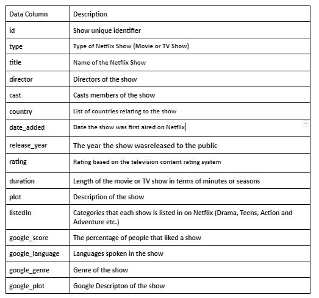
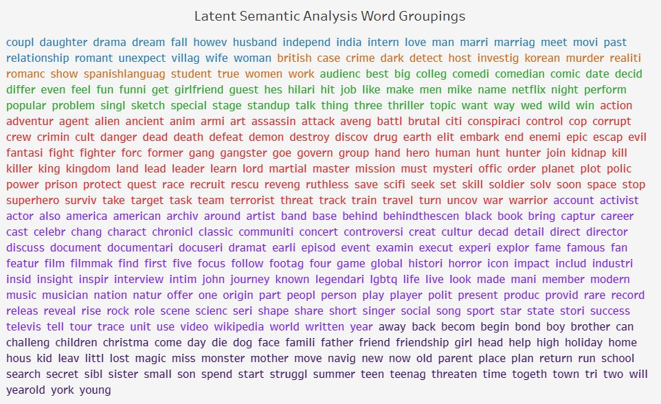

# Section 1 

### Dataset
The Kaggle Netflix dataset provides us with a list of Netflix Shows along with information such as the year it was added, duration, cast, description etc. \

There are altogether 8807 Netflix Shows in this dataset.\

We also supplement the dataset with several features that were scrapped from google.

### Columns in dataset
```{r echo=FALSE, out.width = '70%'}

```

### About
This project is about analysing what makes a show on Netflix more likeable? 

Are TV shows more well received than Movies? 

Are action movies more popular than rom-coms? 

Are shows from Korean more popular than Thai shows?

These answers will help us decide what shows to are more likely to be worth while watching on Netlix and save us valuable time. 

This project aims to answer such questions by running a Multiregression model on Netflix data.

### Algorithm Choice

To solve this problem, I will use the multivariate regression model. \
I use this model to evaluate the correlation between the features in the data set and Google Review Score.\
\
I chose this algorithm because the dependent feature (Google Review Score) is a continuous feature.\
Furthermore, both numeric and categorical features can easily be integrated with this model. \
\
From the multi regression model results, we can determine the degree of influence many different features have on a dependent features.\
Moreover, the effect of each feature can be seen while the effect of the other features are held constant.\
Specifically, a slope coefficient and it’s statistical significance is gained for each feature in the dataset.\
\
Although causality may not be implied with the results, having a sense of what to features of a show to look out for on Netflix could still help us with choosing what to watch.\ 
With that being said, I am aware of the disadvantages that come with this model.\
Some of the problems that I am prepared to face are overfitting, bias-variance dilemma, multicollinearity and the curse of dimensionality


# Section 2 
## Loading Packages
Before we get started. We will load all the relevant Pacakages
```{r load packages, message=FALSE}
library(reticulate)
library(DBI)
library(dplyr)
library(lubridate)
library(tidyr)
library(data.table)
library(quanteda)
library(tm)
library(lsa)
library("quanteda.textmodels")
library(ggplot2)
library(kableExtra)
library(Hmisc)
library(ggcorrplot)
library(forcats)
```

I also use a bit of Python for this project, so I will load some Python packages too

```{r echo=FALSE,}
use_python("C:/venv/Scripts/python.exe")
use_virtualenv("C:/venv")
```

```{python}
import pandas as pd
import requests
import urllib
from requests_html import HTML
from requests_html import HTMLSession
import bs4
```

## Getting Data 

I use two main data sources for this project, namely Kaggle and Google Search Results

### Source 1: Kaggle 
This dataset provides us with a list of Netflix Shows along with information such as the year it was added, duration, cast, description etc..
There are altogether 8807 Netflix Shows in this dataset.
```{r}
netflixData <- read.csv(file = 'datasets/dataset_main.csv')
```

### Source 2: Google Search Results 
The Kaggle dataset doesn’t contain any feature that gives us information about how popular or likable a show was. 
However, with the Netflix Show title, we can perform some web scraping to obtain Review Scores and other information off Google.

The image below shows an example of the data that will be collected for each of the 8808 shows in the Kaggle Dataset, namely Review Score, Description, Genre and Language
To represent popularity, I will use Google Review Scores, this is also going to be my dependent variable. 
```{r echo=FALSE, out.width = '100%'}
# knitr::include_graphics("Search Example.JPG")
```

Google Scrapping Method
Below is the method I use to scrap data off Google. 
```{python}
def get_source(url):
    try:
        session = HTMLSession()
        response = session.get(url)
        return response
    except requests.exceptions.RequestException as e:
        print(e)

def get_googleInfo(title):
    scrapedData = []

    query = urllib.parse.quote_plus(title)
    response = get_source("https://www.google.co.uk/search?q=" + query)
    soup = bs4.BeautifulSoup(response.text,"html.parser")

    rating_object=soup.find_all( "div", {"class":"a19vA"} )
    info_object=soup.find_all( "div", {"class":"rVusze"} )
    desc_object=soup.find_all( "div", {"class":"PZPZlf hb8SAc"} )

    scrapedData.append('Title: ' +title)

    for rating in rating_object:
        ratingInfo = rating.getText()
        rating = ratingInfo[0:3]
        scrapedData.append('Rating: ' +rating)

    for info in info_object:
        info = info.getText()
        if 'Language' in info:
            scrapedData.append(info)
            break
    
    for info in info_object:
        info = info.getText()
        if 'Genre' in info:
            scrapedData.append(info)
            break

    for desc in desc_object:
        description = desc.getText()
        description = description[0:11] + str(': ') + description[11:]
        scrapedData.append(description)
        break
    
    return scrapedData
```
Here is an example of Output, when we insert the hit show "Squid Game" into the method above.

``` {python}
info = get_googleInfo("Squid Game")
print(info)
```


Apply data scraping function on all movie/show titles in dataset. 
Once all the information has been scraped, I write it into a csv file.
``` {python eval = FALSE}
## This batch of code takes ages, do not run it
data = pd.read_csv('netflix_titles.csv')
goolgeInfo = data['title'].apply(get_googleInfo)
goolgeInfo.to_csv('datasets/dataset_googleScraped.csv', encoding='utf-8', index=False)
```

Since the data scrapping was done in Python, I now need to load all Google Search Results data into the R world of this project.
``` {r}
googleData <- read.csv(file = 'datasets/dataset_googleScraped.csv')
```

### Joining the Kaggle Dataset and Google Search Results
I combine both datasets. 
```{r}
con <- dbConnect(RSQLite::SQLite(), ":memory:")

dbWriteTable(con, "netflixData", netflixData)
dbWriteTable(con, "googleData", googleData)

query <- "SELECT netflixData.show_id
        , netflixData.type
        , netflixData.title
        , netflixData.director
        , netflixData.cast
        , netflixData.country
        , netflixData.date_added
        , netflixData.release_year
        , netflixData.rating
        , netflixData.duration
        , netflixData.description
        , netflixData.listed_in
        , googleData.Likes
        , googleData.Languages
        , googleData.Genres
        , googleData.Descriptions
        FROM netflixData left join googleData 
        ON netflixData.show_id= googleData.show_id"
res <- dbSendQuery(con, query)
df <- dbFetch(res)

dbClearResult(res)
```

Both datasets are now joined but the feature names are quite confusing still. I will rename the features before showing a preview of the full combined dataset I will be working with.

## Previewing Raw Data
### Renaming Columns
I rename the columns because some of them had the same names. 
Independent features that were scraped from Google have "google_" at the front of them.
``` {r}
new_names <- c("id" 
        , "type"
        , "title"
        , "director"
        , "cast"
        , "country"
        , "date_added"
        , "release_year"
        , "rating"
        , "duration"
        , "plot"
        , "listedIn"
        , "google_score"
        , "google_language"
        , "google_genre"
        , "google_plot")
df <- setNames(df, new_names)
```
### Data Preview
Here is what the dataset looks like now, we can see all the features that will be used:
``` {r echo=FALSE}
temp = head(df, 10)
temp %>%
  kbl() %>%
  kable_styling() %>%
  column_spec(1, width = "10cm") %>%
  scroll_box(width = "1000px", height = "500px")
```


## Cleaning the data
### Dealing with duplicates 
Checking if there are any duplicated Netflix Shows
``` {r}
print(length(unique(df$title)))
```

``` {r}
duplicated <-df[duplicated(df$title),]
print(duplicated$title)
```
The Netflix shows that were thought to be duplicates by the code before seemed like dates instead.
No duplicates. So we can move on. 

#### Drop rows
Any Netflix Show which does not have a Google Review Score (crucial dependent variable) is an irrelevant observation since it cannot be used for Analysis.
``` {r}
count_blanks <- function(feature) {
    string1 <- feature
    string2 <- '== ""'
    subset = paste(string1, string2)
    subset <- subset(df, eval(parse(text=subset)))
    count <- count(subset)
  return(count)
}

print(count_blanks('google_score'))
```

As expected, the Google search results of some Netflix Shows did not give us a Google Review Score. I drop these rows.
```{r}
df <- df[grep("%", df$google_score),]
```
Below shows and example of a Show which does not give us a Google Review Score
```{r echo=FALSE, out.width = '100%'}
knitr::include_graphics("NoGoogleScore.JPG")
```

We are now left with 6511 rows.
``` {r}
print(length(unique(df$title)))
```

### Handle Missing data
Lets see what data is missing:
```{r}
feature <- new_names # retrieving all the column names

NA_Count <- c(
 toString(count_blanks('id'))
, toString(count_blanks('type'))
, toString(count_blanks('title'))
, toString(count_blanks('director'))
, toString(count_blanks('cast'))
, toString(count_blanks('country'))
, toString(count_blanks('date_added'))
, toString(count_blanks('release_year'))
, toString(count_blanks('rating'))
, toString(count_blanks('duration'))
, toString(count_blanks('plot'))
, toString(count_blanks('listedIn'))
, toString(count_blanks('google_score'))
, toString(count_blanks('google_language'))
, toString(count_blanks('google_genre'))
, toString(count_blanks('google_plot')))
NA_Count <- data.frame(feature, NA_Count)

print(NA_Count)
```

Google Genre and Google Language are missing in a big proportion of rows.
Action: Instead of removing the feature entirely, I'd like to extract some value out of it. I will transform google_language and google_genre feature into present/absent.

``` {r}
df$google_language <- ifelse(df$google_language =="", "absent", "present")
view <- df %>% group_by(google_language) %>% summarise(count = n())
print(view)
```
``` {r}
df$google_genre <- ifelse(df$google_genre =="", "absent", "present")
view <- df %>% group_by(google_genre) %>% summarise(count = n())
print(view)
```

### Fixing structural errors.
Structural errors are when you measure or transfer data and notice strange naming conventions, typos, or incorrect capitalization. These inconsistencies can cause mislabeled categories or classes. For example, you may find “N/A” and “Not Applicable” both appear, but they should be analyzed as the same category. Changing data types

We will look feature by feature for structural errors.

#### 1. Type
``` {r}
view <- df %>% group_by(type) %>% summarise(count = n())
print(view)
```
The type feature looks clean, no action will be taken on it.\
Action: None

#### 2. Director
``` {r}
view <- df %>% group_by(director) %>% summarise(count = n())
print(view)
```
Some of the rows have more than one director. \
Action: In the next Feature Engineering Section, I will make mapping tables and use feature engineering to capture this variable

#### 3. Cast
``` {r}
view <- df %>% group_by(cast) %>% summarise(count = n())
print(view)
```
As expected, many Shows have more than one cast member. \
Action: Similar to what will be done with the Director Feature, I will make mapping tables and use feature engineering to capture this variable

#### 4. Country
``` {r}
view <- df %>% group_by(country) %>% summarise(count = n())
print(view)
```
Some shows originated from several different countries. However, the countries seem to be in the order of influence.\
Action: Take the first country on the list.

``` {r}
df$country <- sub("\\,.*", "", df$country)

view <- df %>% group_by(country) %>% summarise(count = n())
print(view)
```
Some Countries appear very few times \
Also, we don't want too many categories to avoid overfitting and the curse of dimensionality.\
Action: I will group them into an "Others" category if count is less than 100. 
``` {r}
df <- df %>% 
    group_by(country) %>% 
    mutate(country = ifelse(n()>100, country, 'Others'))
```

#### 5. Date Added
``` {r}
view <- df %>% group_by(date_added) %>% summarise(count = n())
print(view)
```
Date Added looks good\
Action: None

#### 6. Release Year
``` {r}
view <- df %>% group_by(release_year) %>% summarise(count = n()) # Show release_year and count by each release_year
print(view)
print(typeof(df$release_year))
```
Release Year has the integer type. No noticable structural error.\
Action: None

#### 7. Rating
``` {r}
view <- df %>% group_by(rating) %>% summarise(count = n()) # Show release_year and count by each release_year
print(view)
```
There are several categories which have similar meaning. \
Similar to the the Country feature, we don't want too many categories to avoid overfitting and the curse of dimensionality.\
Action: Consolidate the categories

Consolidate the categories of the Rating Feature
```{r}
df$rating[df$rating == "PG-13" ] <- "PG"
df$rating[df$rating == "TV-PG" ] <- "PG"
df$rating[df$rating == "TV-14" ] <- "PG"
df$rating[df$rating == "TV-G" ] <- "G"
df$rating[df$rating == "TV-MA" ] <- "R"
df$rating[df$rating == "NC-17" ] <- "R"
df$rating[df$rating == "TV-Y7" ] <- "Y"
df$rating[df$rating == "TV-Y7-FV" ] <- "Y"
df$rating[df$rating == "TV-Y" ] <- "Y"
df$rating[df$rating == "NR" ] <- "UR"
df$rating[df$rating == "66 min" ] <- "UR"
df$rating[df$rating == "84 min" ] <- "UR"
df$rating[df$rating == ""] <- "UR"

view <- df %>% group_by(rating) %>% summarise(count = n()) # Show release_year and count by each release_year
print(view)
```

#### 8. Duration
``` {r}
view <- df %>% group_by(duration) %>% summarise(count = n()) # Show duration and count by each release_year
print(view)
```
Durations with two different units are in the same feature. Also, we can remove their units to make it integers.\
Action: Split column into two different types of durations, remove units
``` {r}
df$duration[df$duration ==""] <- NA
df$duration_min <- ifelse(grepl("min", df$duration),df$duration,NA)
df$duration_season <- ifelse(grepl("Season", df$duration),df$duration,NA)
print(head(df[,c("title","duration_min","duration_season")]))
```

Remove string from duration and convert character to integer
``` {r}
df$duration_min <-  gsub('min','',df$duration_min)
df$duration_min <- as.numeric(df$duration_min)
df$duration_season <-  gsub('Seasons','',df$duration_season)
df$duration_season <-  gsub('Season','',df$duration_season)
df$duration_season <- as.numeric(df$duration_season)
print(head(df[,c("title","duration_min","duration_season")]))
```
Drop duration column
```{r}
df = subset(df, select = -c(duration))
```

#### 9. Plot
Plot contains text data.\
Action: Use Latent Semantic Analysis to categorize plots

#### 10. Listed In
``` {r}
view <- df %>% group_by(listedIn) %>% summarise(count = n()) # Show duration and count by each release_year
print(view)
```
Contains many different category tags for each show, there is too many different combinations.\
Using this feature alone would give us a few hundred features. Again, we want to avoid overfitting and the curse of dimensionality.\
At the same time, there may be lots of useful information in the tags.
Action: Attach Listend In tags to Plot for Latent Semantic Analysis

#### 11. Google Score
``` {r}
view <- df %>% group_by(google_score) %>% summarise(count = n()) # Show google_score and count by each google_score
print(view)
```
Symbol exist and type is character.\
Action: remove symbol and convert type to numeric

``` {r}
df$google_score<-gsub("%","",as.character(df$google_score))
df <- transform(df, google_score = as.numeric(google_score))
```

#### 13. Google Language
Feature was engineered already, so it is clean.

#### 14. Google Genre
Feature was engineered already, so it is clean.

#### 15. Goolge Plot
Goolge Plot contains text data.\
Action: Use Latent Semantic Analysis to categorize plots


## Data Transformation

### Mapping Tables 
As talked about in the Data Cleaning Section above, I will build a mapping table for Cast and Director.\

This would help reflect their one to many relationship.

#### Build Director Mapping Table
``` {r}

director_mapping <- df %>%
    mutate(director = strsplit(as.character(director), ",")) %>%
    unnest(director)

director_mapping = subset(director_mapping, select = c(id, director))
director_mapping$director <- trimws(director_mapping$director , which = c("left"))

write.csv(director_mapping, "datasets/mapping_director.csv", row.names=FALSE)
```

#### Build Cast Mapping Table
``` {r}
cast_mapping <- df %>%
    mutate(cast = strsplit(as.character(cast), ",")) %>%
    unnest(cast)

cast_mapping = subset(cast_mapping, select = c(id, cast))
cast_mapping$cast <- trimws(cast_mapping$cast, which = c("left"))
write.csv(cast_mapping, "datasets/mapping_cast.csv", row.names=FALSE)
```


## Feature engineering  
### Cast
IMDB provides a dataset of Top 1000 Actors and Actresses based on their popularity. \

Analyse the IMDB actors dataset
``` {r}
IMDBActors <- read.csv(file = 'datasets/dataset_popular_actors.csv')
print(head(IMDBActors))
```
The dataset  includes a numeric measure of their popularity in the column "Points".\
I clean that column so that it can be engineered, transformed and used as a feature in the main dataset.\
I write the data into a csv as a view

```{r}
IMDBActors <- separate(IMDBActors, Description, c("Points", "Description"))
IMDBActors <- transform(IMDBActors, Points = as.numeric(Points))
```

I do the same with the IMDB Actress dataset
``` {r}
IMDBActress <- read.csv(file = 'datasets/dataset_popular_actresses.csv')

IMDBActress <- separate(IMDBActress, Description, c("Points", "Description"))
IMDBActress <- transform(IMDBActress, Points = as.numeric(Points))

```

Once that is done, I attach the points of each Actor/Actress to the cast mapping table. (Not all cast members in the table have points because they may not be in the IMDB list)
``` {r message=FALSE, warning=FALSE}
con <- dbConnect(RSQLite::SQLite(), ":memory:")

dbWriteTable(con, "cast", cast_mapping)
dbWriteTable(con, "actorsPoints", IMDBActors)
dbWriteTable(con, "actressesPoints", IMDBActress)

query <- "SELECT c.id
                ,c.cast
                ,CASE WHEN a.Points IS NOT NULL THEN a.Points
                WHEN b.Points IS NOT NULL THEN b.Points 
                ELSE 0 END AS Points
                FROM cast c
                LEFT JOIN actorsPoints a ON c.cast = a.Name
                LEFT JOIN actressesPoints b ON c.cast = b.Name"
res <- dbSendQuery(con, query)

castPointsMapping <- dbFetch(res)

dbWriteTable(con, "castPointsMapping", castPointsMapping)
```
There are many ways to engineer a new feature with this new dataset. 
For simplicity and interpretability, if there are points attached to at least one of the actors/actresses in a show, I give the new feature cast_points the value "known", otherwise, it is labelled as "unknown".
```{r}
dbWriteTable(con, "main", df)

query <- "SELECT a.*
        , CASE WHEN c.Points IS NOT NULL THEN 'known'
        ELSE 'unknown' END AS cast_points
        FROM main a 
        LEFT JOIN castPointsMapping c ON a.id = c.id 
        GROUP BY a.id"

res <- dbSendQuery(con, query)
df <- dbFetch(res)

print(head(df[,c("title","cast_points")]))

```
### Directors
Similar to what was done with the cast, I do the same for directors
``` {r message=FALSE, warning=FALSE} 
IMDBDirectors <- read.csv(file = 'datasets/dataset_popular_directors.csv')

IMDBDirectors <- separate(IMDBDirectors, Description, c("Points", "Description"))
IMDBDirectors <- transform(IMDBDirectors, Points = as.numeric(Points))

dbWriteTable(con, "main_2", df)
dbWriteTable(con, "directorsPoints", IMDBDirectors)
dbWriteTable(con, "director", director_mapping)

query <- "SELECT a.id
                ,a.director
                ,CASE WHEN d.Points IS NOT NULL THEN d.Points
                ELSE 0 END AS Points
                FROM director a
                LEFT JOIN directorsPoints d ON a.director = d.Name"
res <- dbSendQuery(con, query)
directorPointsMapping <- dbFetch(res)
dbClearResult(res)

dbWriteTable(con, "directorPointsMapping", directorPointsMapping)

query <- "SELECT a.*
        , CASE WHEN d.Points IS NOT NULL THEN 'known'
        ELSE 'unknown' END AS director_points
        FROM main_2 a 
        LEFT JOIN directorPointsMapping d ON a.id = d.id 
        GROUP BY a.id"

res <- dbSendQuery(con, query)
df <- dbFetch(res)

dbClearResult(res)

print(head(df[,c("title","director_points")]))
``` 

Drop Director and Cast Column
```{r}
df = subset(df, select = -c(cast,director) )
```

Before carrying out further analysis, I disconnect from SQLite I write the main dataframe into a csv 
``` {r}
dbDisconnect(con)
write.csv(df, "datasets/view_main_cleaned.csv", row.names=FALSE)
```

## Data Preview
Here is what the dataset looks like now after cleaning
``` {r echo=FALSE}
temp = head(df, 10)
temp %>%
  kbl() %>%
  kable_styling() %>%
  column_spec(1, width = "10cm") %>%
  scroll_box(width = "1000px", height = "500px")
```


## Feature Engineering -  Latent Semantic Analysis of Plot and google plot data
#### load data
The features plot, google plot and listedIn provides us with text data which we could not use directly as features.\
To extract valuable information from it, I use a technique in natural language processing.\
Latent Semantic Analysis (LSA) Uses the statistical approach to identify the association among the words in a document.\
This means we can use LSA to identify the similarity between Netflix Shows base on the text in their plot, google plot and listed In tags.
Using LSA, we will also group similary Shows and use these groups in the Multiregression mode.

``` {r}
main <- read.csv(file = 'datasets/view_main_cleaned.csv')
main$plot_combined <- paste(main$plot,main$listedIn,main$google_plot)
```
#### Convert data to corpus
``` {r}
corpus <- Corpus(VectorSource(main$plot_combined))
```

#### Remove special characters, case, punctuation and numbers
``` {r message=FALSE, warning=FALSE}

removeSpecialChars <- function(x) gsub("[^a-zA-Z0-9 ]","",x)
corpus <- tm_map(corpus, removeSpecialChars)
corpus <- tm_map(corpus, removeNumbers)
corpus <- tm_map(corpus, removePunctuation)
corpus <- tm_map(corpus, content_transformer(tolower))
```

#### Remove stop words
``` {r message=FALSE, warning=FALSE}
corpus <- tm_map(corpus, removeWords, stopwords("english"))
```

#### Remove white space
``` {r message=FALSE, warning=FALSE}
corpus <- tm_map(corpus, stripWhitespace)
```

#### Stemming
``` {r message=FALSE, warning=FALSE}
corpus <- tm_map(corpus, stemDocument)
```

#### Term document matrix
``` {r message=FALSE, warning=FALSE}
tdm <- TermDocumentMatrix(corpus)
```

#### View top 20 most frequently occuring term
``` {r }
tdmMatrix <- as.matrix(tdm)
v <- sort(rowSums(tdmMatrix), decreasing=TRUE)
d <- data.frame(word=names(v),freq=v)
print(head(d,20))
```

#### Weighting 
``` {r}
tdm2 <- as.textmatrix(as.matrix(tdm))
tdm.weighted <- lw_logtf(tdm2)
```

#### Latent Semantic Analysis
``` {r eval=FALSE}
lsa <- lsa(tdm.weighted, dims=6)

Tk <- lsa$tk
Sk <- lsa$sk
Dk <- lsa$dk 
```

#### Varimax Rotation
``` {r eval=FALSE}
Tk.varimax <- varimax(Tk)

Dk.rotated <- Dk %*% Tk.varimax$rotmat
Tk.rotated <- Tk %*% Tk.varimax$rotmat 
```

#### Interreting Term and Document Matrices
``` {r eval=FALSE}

sort.loadings.table <- function(x) {
    factor.names <- colnames(x)
    x <- as.data.frame(x)
    x$max.factor <- apply(abs(x),1,which.max)
    x$max.value <- x[cbind(1:nrow(x),x$max.factor)]
    x <- x[order(x$max.factor,-abs(x$max.value)),]
    x$item <- rownames(x)
    rownames(x) <- NULL
    x
}

threshold.loadings.table <- function (x,q=0.1) {
    threshold <- quantile(abs(x$max.value),probs=1-q)
    x <- subset(x,abs(x$max.value)>threshold)
    x
}

Tk.thresholded <- as.data.table(threshold.loadings.table(sort.loadings.table(Tk.rotated),q=0.02))
write.csv(Tk.thresholded[,.(item, max.factor, max.value)], "datasets/tk.csv", row.names=FALSE)

Dk.thresholded <- as.data.table(threshold.loadings.table(sort.loadings.table(Dk.rotated),q=1))
print(Dk.thresholded[,.(item,max.factor,max.value)])
write.csv(Dk.thresholded[,.(item,max.factor,max.value)],"datasets/dk.csv", row.names=FALSE)
```
Below shows a collection of words from the LSA analysis.\
 Words of the same group have the same colour
```{r echo=FALSE, out.width = '100%'}

```
These Are my findings from the groupings:\
Group 1 (blue) love, romance and marriage\
Group 2 (orange) crime and investigation\
Group 3 (green) comedy\
Group 4 (red) action, adventure and sci-fi\
Group 5 (purple) documentaries and docuseries\
Group 6 (grey) children\


#### Join LSA data to main dataframe

``` {r}
con <- dbConnect(RSQLite::SQLite(), ":memory:")

main <- read.csv(file = 'datasets/view_main_cleaned.csv')
lsa <- read.csv(file = 'datasets/dk.csv')

lsa$item <- sub("^", "s", lsa$item)
 
dbWriteTable(con, "main", main)
dbWriteTable(con, "lsa", lsa)

query <- "SELECT m.*, l.[max.factor] as lsa_value
                FROM main m
                LEFT JOIN lsa l ON m.id = l.item"
res <- dbSendQuery(con, query)
df <- dbFetch(res)
dbClearResult(res)

df = subset(df, select = -c(plot,google_plot,listedIn))

write.csv(df, "datasets/view_main_lsa.csv", row.names=FALSE)

dbDisconnect(con)
```
#### Data Preview 
``` {r echo=FALSE}
temp = head(df, 10)
temp %>%
  kbl() %>%
  kable_styling() %>%
  column_spec(1, width = "10cm") %>%
  scroll_box(width = "1000px", height = "500px")
```

## Exploratory Data Analysis

### Feature Description 

1. Type : Type of Netflix Show (Movie or TV Show)
2. Title: Name of the Netflix Show
3. Country: List of countries relating to the show
4. Date Added: Date the show was put on Netflix
5. Release Year: Year the show was first released
6. Rating: List of genres of the show 
7. Google Score: Displayed on Google as the percentage of viewers that liked a show
8. Google Genre: Whether or not Genre is absent/present in the google search
9. Google Language: Whether or not Language is absent/present in the google search
10. Duration Minutes: Duration of the movie in minutes
11. Duration Seasons: Durationg of the TV show in terms of how many seasons it has
12. Cast Points: Whether or not the cast members are famous according to IMDB
13. Director Points: Whether or not the directors are famous according to IMDB
14. LSA Value: Category of the show according to the LSA algorithm

Dependent Feature: Google Score

### Distribution Analysis of each Feature
Click through the tableau story to see how each feature is distributed:

<iframe src=" https://public.tableau.com/views/NetflixDistribution/Story1?:language=en-GB&publish=yes&:display_count=n&:origin=viz_share_link
:showVizHome=no&:embed=true"
 width="1050" height="870"></iframe>


### Bivariate Analysis - Significant Correlations
Click through the tableau story to see how each feature is correlated with Google Scores:
<iframe src=" https://public.tableau.com/views/BivariateAnalysisNetflix/Story1?:language=en-GB&publish=yes&:display_count=n&:origin=viz_share_link
:showVizHome=no&:embed=true"
 width="1050" height="850"></iframe>

### Feature Selection
The duration of a show both in terms of minutes and seasons seem to have a very strong positive correlation with the likeability of a show.\
Since many popular and highly rated shows will more likely renew for a next season, there is a high chance of reverse causality.\
Because of this, I remove duration_season from the multi regression analysis.

Similarly, there is a high chance that if a show is very popular, google is more likely to list it's genre and language.
To mitigate the effects of reverse causality on the model, I remove google genre and google language from the model.

## Machine learning with Multi Regression

``` {r}
main <- read.csv(file = 'datasets/view_main_lsa.csv')
```

```{r  echo=FALSE}
main$date_added <- mdy(main$date_added)
main$lsa_value <- as.character(main$lsa_value)
main$duration_min <- main$duration_min %>% replace(is.na(.), 0)
main$duration_season <- main$duration_season %>% replace(is.na(.), 0)
``` 

Score as a function of all the features
```{r}
main = subset(main, select = -c(id,title,duration_season, google_genre, google_language))

model = lm(log(google_score)~., data=main)
print(summary(model))
```

### Findings 

Positively Correlated with significance \
* TV Show\
* Japan, South Korea,United Kingdom, United States\
* Duration minutes\

Negatively Correlated with significance \
* Release Year\
* Rating Y\

These findings suggest that TV shows are more likeable than movies when other features are held constant.\
Furthermore, shows from Japan, South Korea, United Kingdom, United States also do better.\
The longer the movie, the higher it's score\

On the other hand, there is a significant negavite correlation between a show's likeability and it's release_year.\
Shows with a Rating Y (All Children) also have a negative correlation with it's google score.\

### Discussion

Throughout the process, I noted a few thing that might affect the accuracy of the model.\
1. All the shows in the data set are selected by Netflix, in no way does it represent all the shows that exist in the world.\
2. Since I only use the data if I can retrieve it’s Google Review Score data, the shows that are in analysed in the model are biased. For example, Google will most likely only be able to provide data for well-known shows in the English speaking world. Furthermore, show titles which are not unique enough are less likely to have a Google Score  search result.\
3. IMDB Top Actors and Directors Lists are likely to be biased towards the English speaking world, meaning cast or director that could be hugely popular in their origin country might not be classified as “Known”.\
\
The random quirks of this sample could cause and overfitting of the multi regression model and reduce its usability on datasets from the non-Netflix world.\
That being said, the large amount of oversations that we have (6511 titles) could ease the risk of overfitting. \
\
There were still a lot of features that could have been created with the dataset. \
For example, more data from Google could have been scraped, more features could have been engineered from the existing Netflix dataset, etc. \
However, I took steps to avoid the curse of dimensionality, which indicates that the number of samples needed to estimate an arbitrary function with a given level of accuracy grows exponentially with respect to the number of input variables.\
From the data I had, I selected features which I found most interesting and likely to explain the score \
\
Similarly, I also considered how interpretable the features in the model were.\
 Although certain features could increase model accuracy, they also increased model complexity, at the cost of interpretability.\
All the features apart from the LSA value are very easility interpretable features.\
\
Another issue I was looking out for was the bias-variance trade off.\
If our model is too simple and has very few parameters then it may have high bias and low variance.\
On the other hand if our model has large number of parameters then it’s going to have high variance and low bias\